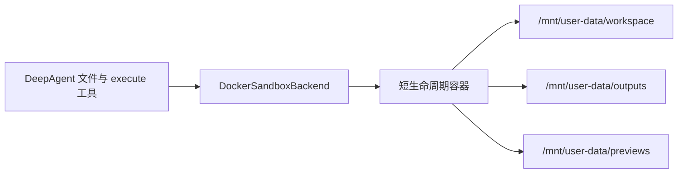

# Docker 隔离执行器

该目录保存 Keen Agent 沙箱镜像定义。模型不会直接访问 Docker socket，而是由
`DockerSandboxBackend` 使用 Docker CLI 为每条命令创建短生命周期容器。

完整的用户请求流程、代码架构、安全边界和产物发布说明见
[沙箱执行、产物下载与页面预览架构](../../docs/sandbox-architecture.md)。

## 目录职责

```text
.sandbox/
├── Dockerfile                 # Node/Python/文档库与离线 Web 依赖镜像
├── prepare-web-project        # 给模型已创建的项目连接离线依赖
├── web-runtime/package.json   # 固定 React/Vite 运行时版本
└── README.md                  # 镜像维护与使用约定
```

该目录只有镜像运行时资源，没有用户项目模板。实际页面、脚本和文档内容由 DeepAgent
写入每轮 `/mnt/user-data/workspace`，执行结束后由 `ai-server` 从明确出口复制发布。

## 构建镜像

```bash
docker build -t keen-agent-sandbox:latest ai-agent/.sandbox
```

镜像包含 Node.js、Python、Pillow、python-pptx、python-docx、openpyxl、ReportLab
和 Matplotlib，可生成 PPTX、DOCX、XLSX、PDF、图片及普通代码产物。

镜像内容修改后需要重新构建；只重启 Next/Nest 不会更新已有 Docker image。

镜像只预装离线 React/Vite 依赖，不包含任何预制官网页面。Agent 先在本轮工作区自行
创建或修改源码，再连接离线依赖并构建：

```bash
mkdir -p website/src
prepare-web-project website
# 使用 write_file 创建 website/index.html、website/src/* 等用户要求的内容
cd website
npm run build
mkdir -p /mnt/user-data/previews/website
cp -R dist/. /mnt/user-data/previews/website/
```

`prepare-web-project` 只补充通用 `package.json`（不存在时）和指向镜像内依赖的
`node_modules` 符号链接，不创建页面正文、组件或样式。不需要也不允许在运行时执行
`npm install`。最终预览目录必须包含 `index.html`。

## 与 DeepAgent 的关系



一次聊天请求创建一份会话目录；一次 `execute` 启动一个容器。多个容器通过本轮
`/mnt/user-data` 共享文件，但不会共享后台进程。模型完成后，服务器先发布 outputs 和
previews，再删除会话目录。

运行时默认关闭网络，根文件系统只读，并限制 CPU、内存、进程数。只有本轮的
`/mnt/user-data` 可写，已启用 Skill 同时只读挂载在 `/skills` 和
`/mnt/skills/public`。最终需要下载的文件必须写到 `/mnt/user-data/outputs`。

静态页面必须写到 `/mnt/user-data/previews/<name>/`，且目录中存在 `index.html`。
不要长期启动 `npm run dev`；命令容器结束时进程会退出，应使用 `npm run build` 发布静态结果。
