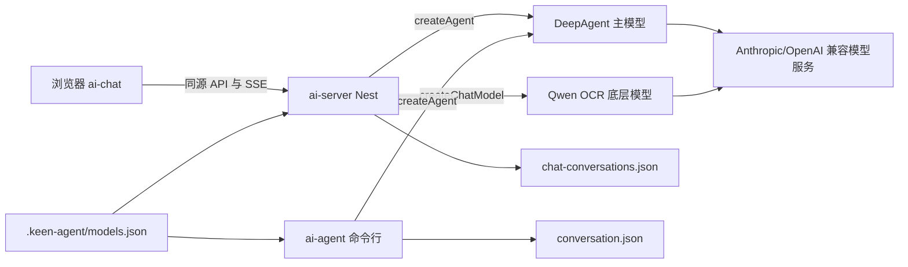

# Keen Agent 核心包

`ai-agent` 是整个仓库共享的 AI 核心包，负责模型配置、LangChain 模型客户端、DeepAgent、工具定义以及命令行会话。`ai-server` 会直接复用它导出的模型工厂和 Agent 工厂，避免 Web 与命令行各自维护一套模型连接逻辑。

## 整体架构



三个工作区的职责如下：

| 工作区 | 职责 |
| --- | --- |
| `ai-chat` | 浏览器界面、图片选择、模型选择和 SSE 展示 |
| `ai-server` | HTTP API、会话持久化、图片校验与双模型编排 |
| `ai-agent` | 模型配置、Provider 工厂、DeepAgent、工具和命令行入口 |

Web 与命令行共用 `.keen-agent/models.json`，但会话历史相互独立：

- Web 会话：`.keen-agent/chat-conversations.json`
- 命令行会话：`.keen-agent/conversation.json`

## 内部模块

| 文件 | 职责 |
| --- | --- |
| `src/index.ts` | 加载 `ai-agent/.env` 并启动命令行程序 |
| `src/agent.ts` | 创建底层聊天模型、系统提示词、工具与 DeepAgent |
| `src/model-config.ts` | 校验、加载、保存模型注册表并解析环境变量 |
| `src/conversation.ts` | 命令行多轮对话、流式消息、工具事件和模型切换 |
| `src/conversation-store.ts` | 序列化并原子保存命令行消息历史 |
| `src/util.ts` | 终端颜色、加载动画与消息格式化工具 |

## 模型调用层次

### 底层聊天模型

`createChatModel(config)` 根据 `provider` 创建 LangChain 客户端：

- `anthropic`：创建 `ChatAnthropic`，用于 Anthropic Messages 兼容接口。
- `openai`：创建 `ChatOpenAI`，用于 OpenAI Chat Completions 兼容接口。

这里不挂载工具，也不运行 Agent 循环。Nest 的 Qwen OCR 预处理会直接使用这个函数。

### 主 Agent

`createAgent(config, features)` 在底层模型之上创建 DeepAgent，并注入：

- 统一中文系统提示词；
- 当前模型身份；
- OCR、文件和网页内容的提示词注入防护；
- `tiandi_tongshou` 示例工具；
- `MemorySaver` 内存检查点。

`features` 支持两个可选开关，省略时都默认为 `true`，因此命令行入口保持原有行为：

- `thinkingEnabled`：选择“充分分析”或“优先直接回答”的系统提示策略。
- `toolsEnabled`：为 `true` 时注册工具，为 `false` 时给 DeepAgent 传入空工具列表。

命令行聊天和 Web 的主模型回答都使用这个工厂。Web 会从当前会话读取上述开关，每次请求
创建临时线程并注入服务端完整历史；命令行则在进程内持续复用同一线程。

## 图片双模型流程

图片功能是 `ai-server` 中的固定两阶段编排，不是主 Agent 自主调用的子 Agent：

```text
图片
  → createChatModel(qwen3.5-ocr)
  → 完整 OCR 与结果规范化
  → 缓存到用户消息的 imageAnalysis
  → 原问题 + 低权限 OCR 上下文
  → createAgent(DeepSeek 等主模型)
  → 最终回答
```

这种方式保证每次上传图片都会先完成 OCR，并且不会让不支持图片的主模型接收图片数据块。OCR 结果会持久化，后续文字追问无需重复识别。

如果用户直接选择 `qwen3.5-ocr`，Nest 会绕过 DeepAgent 和工具定义，直接调用底层模型。原因是 OCR 模型不支持工具调用，而且它的职责只是文字提取。

## 模型注册表

默认文件为仓库根目录的 `.keen-agent/models.json`。示例：

```json
{
  "version": 1,
  "activeModelId": "deepseek-v4-flash",
  "models": [
    {
      "id": "qwen3.5-ocr",
      "name": "qwen3.5-ocr",
      "provider": "openai",
      "model": "qwen3.5-ocr",
      "apiKeyEnv": "QWEN_API_KEY",
      "baseUrl": "https://{WorkspaceId}.cn-beijing.maas.aliyuncs.com/compatible-mode/v1",
      "temperature": 0,
      "timeoutMs": 15000,
      "maxRetries": 1
    },
    {
      "id": "deepseek-v4-flash",
      "name": "deepseek-v4-flash",
      "provider": "anthropic",
      "model": "deepseek-v4-flash",
      "apiKeyEnv": "DS_ANTHROPIC_API_KEY",
      "baseUrlEnv": "DS_ANTHROPIC_BASE_URL",
      "temperature": 0,
      "timeoutMs": 15000,
      "maxRetries": 1
    }
  ]
}
```

`provider` 表示 API 兼容协议，不代表模型厂商。Qwen OCR 官方端点使用 OpenAI 兼容协议；当前 DeepSeek 接口使用 Anthropic 兼容协议。

配置只保存环境变量名，不保存密钥。`resolveModelConfig` 会在创建模型时读取 `apiKeyEnv` 和可选的 `baseUrlEnv`；也可以直接使用 `baseUrl`。

如果模型注册表不存在，程序会读取 `MODEL`、`ANTHROPIC_API_KEY` 和 `ANTHROPIC_BASE_URL` 创建一条默认的 Anthropic 兼容配置。

## 环境变量

在 `ai-agent/.env` 中配置模型注册表引用的变量，例如：

```bash
QWEN_API_KEY=你的百炼密钥
DS_ANTHROPIC_API_KEY=你的主模型密钥
DS_ANTHROPIC_BASE_URL=https://api.example.com/anthropic
```

不要把真实密钥写进 README、源码或 `.keen-agent/models.json`。

Web 图片编排还支持：

```bash
VISION_MODEL_ID=qwen3.5-ocr
```

未配置时默认使用 `qwen3.5-ocr`。

## 命令行运行

在仓库根目录执行：

```bash
pnpm install
pnpm dev:server
```

命令行支持：

- `/model`：打开模型选择器。
- `/model list`：列出模型。
- `/model current`：显示当前模型。
- `/model <模型 ID 或序号>`：切换模型。
- `exit`、`quit` 或 `退出`：结束会话。

命令行当前面向支持 DeepAgent 工具调用的主模型；OCR 图片上传由 Web/Nest 流程负责。

## 被其他工作区调用

包对外导出：

```typescript
import { createAgent, createChatModel } from '@keen-agent/ai-agent/agent';
import {
  loadModelRegistry,
  resolveModelConfig,
} from '@keen-agent/ai-agent/model-config';
```

`ai-server` 通过 workspace 依赖直接引用这些 TypeScript 模块。

## 质量检查

```bash
pnpm --filter @keen-agent/ai-agent typecheck
```

如需验证整个仓库：

```bash
pnpm typecheck
pnpm --filter @keen-agent/ai-server build
pnpm --filter @keen-agent/ai-chat build
```
