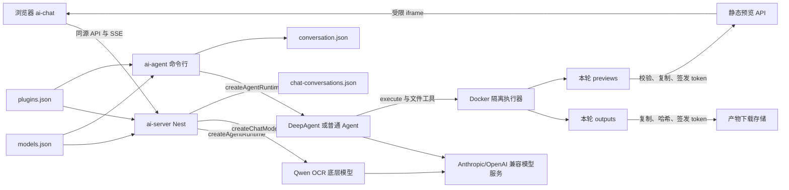

# Keen Agent 核心包

`ai-agent` 是整个仓库共享的 AI 核心包，负责模型与插件配置、LangChain 模型客户端、DeepAgent、工具运行时以及命令行会话。`ai-server` 会直接复用它导出的模型工厂和 Agent 运行时，避免 Web 与命令行各自维护一套模型和插件连接逻辑。

沙箱从用户请求到 Docker、产物下载和页面预览的完整实现，请阅读
[沙箱执行、产物下载与页面预览架构](../docs/sandbox-architecture.md)。该文档同时列出所有
新增文件、虚拟目录映射、安全参数、使用示例和端到端流程图。

## 整体架构



三个工作区的职责如下：

| 工作区 | 职责 |
| --- | --- |
| `ai-chat` | 浏览器界面、图片选择、模型选择和 SSE 展示 |
| `ai-server` | HTTP API、会话持久化、图片校验与双模型编排 |
| `ai-agent` | 模型配置、Provider 工厂、DeepAgent、工具和命令行入口 |

Web 与命令行共用模型和插件注册表，但会话历史相互独立：

- 模型注册表：`.keen-agent/models.json`
- 插件注册表：`.keen-agent/plugins.json`

- Web 会话：`.keen-agent/chat-conversations.json`
- 命令行会话：`.keen-agent/conversation.json`

## 内部模块

目录分层参考 [Pi Coding Agent](https://github.com/earendil-works/pi/tree/main/packages/coding-agent/src) 的 `core`、`cli` 与资源加载器设计，但按本项目规模保留更少层级：

```text
ai-agent/
├── .skills/                       # 项目级 Skill 完整资源包
├── .mcp/                          # 本地 stdio MCP 包和工作目录
├── .sandbox/                      # Docker 沙箱镜像定义
└── src/
    ├── core/
    │   └── agent.ts               # 模型工厂、提示词与 Agent 运行时
    ├── config/
    │   ├── paths.ts               # 仓库、状态和资源根目录
    │   ├── model-config.ts        # 模型注册表
    │   └── plugin-config.ts       # 插件注册表与路径迁移
    ├── plugins/
    │   ├── builtin-tools.ts       # 系统内置工具目录
    │   ├── mcp-loader.ts          # MCP 连接和工具发现
    │   ├── skill-loader.ts        # Skill 校验与完整目录装载
    │   └── runtime.ts             # 本轮插件能力聚合
    ├── sandbox/
    │   ├── docker-sandbox.ts      # DeepAgent Docker Backend
    │   ├── local-artifact-publisher.ts # CLI 产物与页面持久化
    │   ├── types.ts               # 沙箱与发布协议
    │   └── index.ts               # 沙箱公共导出
    ├── cli/
    │   ├── conversation.ts        # 命令行多轮会话
    │   ├── conversation-store.ts  # 命令行历史持久化
    │   └── terminal.ts            # 终端展示工具
    └── index.ts                   # CLI 启动入口
```

包导出仍保留 `@keen-agent/ai-agent/agent`、`model-config`、`plugin-config` 和 `plugin-runtime`，因此内部移动不会要求其他工作区同步修改导入语句。

## 本地资源目录

- `.skills/<name>/` 保存包含 `SKILL.md`、`scripts/`、`references/` 和 `assets/` 的完整 Skill。插件路径可以只填写 `<name>`，也可以填写 `ai-agent/.skills/<name>`。
- `.mcp/<plugin-id>/` 保存本地 stdio MCP 包。配置中的相对 `cwd` 以该目录为基准；HTTP MCP 不需要本地目录。stdio 配置可以先不填写启动命令保存为草稿，但测试或运行前仍需补充。
- `.sandbox/` 保存沙箱镜像定义；运行产生的临时工作区位于被忽略的 `.keen-agent/sandboxes/`。
- `.keen-agent/plugins.json` 仍是启停状态和连接参数的共享索引，不保存 Skill 正文、MCP 源码或密钥。

旧的 `ai-agent/skills/...` 配置会在读取注册表时自动迁移为 `ai-agent/.skills/...`。

## 模型调用层次

### 底层聊天模型

`createChatModel(config)` 根据 `provider` 创建 LangChain 客户端：

- `anthropic`：创建 `ChatAnthropic`，用于 Anthropic Messages 兼容接口。
- `openai`：创建 `ChatOpenAI`，用于 OpenAI Chat Completions 兼容接口。

这里不挂载工具，也不运行 Agent 循环。Nest 的 Qwen OCR 预处理会直接使用这个函数。

### Agent 运行时

`createAgentRuntime(config, features)` 读取插件注册表并返回 Agent、Skill 虚拟文件和资源清理函数。运行时会注入：

- 统一中文系统提示词；
- 当前模型身份；
- OCR、文件和网页内容的提示词注入防护；
- 当前已启用的本地工具、MCP 工具和 Skills；
- `MemorySaver` 内存检查点。

`features` 支持两个可选开关，省略时都默认为 `true`，因此命令行入口保持原有行为：

- `thinkingEnabled`：选择“充分分析”或“优先直接回答”的系统提示策略。
- `toolsEnabled`：当前会话的插件总开关。关闭时不会读取 Skill、连接 MCP 或暴露任何工具。

当 `toolsEnabled` 和 `deepagent-core` 都开启时创建 DeepAgent，提供规划、临时文件工作区和任务委派等内置能力。关闭其中任意一项时改用普通 LangChain Agent，因此不是只靠提示词隐藏 DeepAgent 内置工具。

命令行聊天和 Web 的主模型回答都使用这个工厂。Web 会从当前会话读取上述开关，每次请求
创建临时线程并注入服务端完整历史；命令行则在进程内持续复用同一线程。

## 图片双模型流程

图片功能是 `ai-server` 中的固定两阶段编排，不是主 Agent 自主调用的子 Agent：

```text
图片
  → createChatModel(qwen3.5-ocr)
  → 完整 OCR 与结果规范化
  → 缓存到用户消息的 imageAnalysis
  → 原问题 + 低权限 OCR 上下文
  → createAgentRuntime(DeepSeek 等主模型)
  → 最终回答
```

这种方式保证每次上传图片都会先完成 OCR，并且不会让不支持图片的主模型接收图片数据块。OCR 结果会持久化，后续文字追问无需重复识别。

如果用户直接选择 `qwen3.5-ocr`，Nest 会绕过 DeepAgent 和工具定义，直接调用底层模型。原因是 OCR 模型不支持工具调用，而且它的职责只是文字提取。

## 插件注册表

默认文件为 `.keen-agent/plugins.json`，包含四类插件：

- `builtin`：DeepAgent 自带的规划、文件工作区和 `task` 等能力，作为一个系统插件管理。
- `tool`：项目源码中实现并登记在工具目录中的本地工具。
- `mcp`：通过 `@langchain/mcp-adapters` 连接的 stdio 或 Streamable HTTP MCP 服务。
- `skill`：位于 `.skills/` 或显式路径中的完整 Agent Skills 目录；必须包含 `SKILL.md`，且目录名称与 frontmatter 中的 `name` 一致。

系统插件可启停但不能删除或在线修改实现。MCP 和 Skill 可以从 Web 管理页增删改查和测试；MCP 支持表单或单服务 `mcpServers` JSON，并可在保存前测试草稿连接。MCP 配置只保存环境变量名称：stdio 使用“子进程变量 → 宿主变量”，HTTP 使用“Header → 宿主变量”映射，真实密钥仍保存在 `ai-agent/.env`。

Skills 页还可以运行 `npx` / `uvx` 安装命令。命令固定在 `ai-agent` 下通过参数数组执行，不经过宿主 shell；服务端只扫描项目内约定的 Skills 目录，使用同一加载器校验本次新增的目录，再自动写入插件注册表。安装器本身仍是第三方宿主代码，因此该入口必须按管理员能力保护并只使用可信来源。

多个 MCP 会按插件建立独立连接。某个可选 MCP 出现鉴权、欠费、超时或网络故障时，只移除该插件本轮的工具并记录警告，不再阻止整个 Agent 初始化；模型会被明确告知不得伪造该插件的实时结果。管理页“测试”仍会对被测插件返回失败，并显示经过脱敏的具体原因。

启用 Skill 时，运行时会装载目录中的 `SKILL.md`、`scripts/`、`references/` 和 `assets/`。未开启 Docker 沙箱时，这些文件映射到内存 StateBackend 的 `/skills/<name>/`；开启沙箱后，只把已启用 Skill 物化并只读挂载到 `/skills/<name>/` 和兼容路径 `/mnt/skills/public/<name>/`。符号链接不会被跟随；每个 Skill 最多 128 个文件、单文件 10 MB、总计 20 MB。当 DeepAgent 核心插件关闭时，只有 `SKILL.md` 内容会加入普通 Agent 的系统指令。

## Docker 隔离执行、产物与页面预览

默认系统插件 `docker-sandbox` 使用 DeepAgent 原生 Sandbox Backend 提供真实的
`execute` 和文件工具。先构建本机镜像：

```bash
docker build -t keen-agent-sandbox:latest ai-agent/.sandbox
```

安全边界如下：

- 每次命令使用短生命周期容器，命令不会经过宿主 shell。
- DeepAgent 的虚拟 `rootDir` 是 `/mnt/user-data`，宿主侧只对应 `.keen-agent/sandboxes/<session>/user-data`，不是仓库根目录。
- `write_file`、二进制读取和 `edit_file` 通过受限文件适配层持久化，但路径解析固定在上述会话目录；相对路径固定落到 `workspace/`，不会使用 AI Server 的 `process.cwd()`。文本读取、搜索、删除及所有脚本命令则通过容器执行。
- 默认关闭网络、只读根文件系统、删除全部 Linux capabilities，并启用 `no-new-privileges`。
- 限制为 1.5 CPU、768 MB 内存、128 个进程；不挂载 Docker socket、仓库或宿主环境变量。
- 仅 `/mnt/user-data` 可写；工作文件放在 `workspace/`，最终产物放在 `outputs/`。
- 用户网站源码由模型通过沙箱文件工具逐个创建和修改；镜像只预装依赖，不包含预制网站内容。
- React/Vite 项目可以调用 `prepare-web-project <目录>` 连接镜像内的离线依赖；该命令只准备依赖与通用 `package.json`，不会生成页面源码。
- 静态站点构建后把 `dist` 内容复制到 `previews/<名称>/`；目录必须包含 `index.html`，Web 端会发布为受限 iframe 预览。
- 本轮结束后临时目录删除；Web 服务会先把 outputs 和 previews 中通过校验的内容复制到持久发布目录。
- 单个容器文件上限 100 MB；每轮最多发布 20 个产物、总计 250 MB，符号链接不会发布。

Web 端产物会生成 `/api/ai-server/artifacts/:id/download?token=...` 链接。下载时同时校验随机 UUID、随机 token、文件大小和元数据，响应使用 `attachment` 且禁止缓存。命令行会把产物复制到 `.keen-agent/cli-artifacts/` 并输出持久的本地 `file://` 链接。

页面预览会生成 `/api/ai-server/previews/:id/:token/index.html` 链接。每轮最多发布 5 个站点，每个站点最多 2,000 个普通文件、100 MB、20 层目录；符号链接不会被复制。浏览器 iframe 不授予同源、表单、下载或打开新窗口的权限，响应同时限制网络连接、摄像头、麦克风等浏览器能力。命令行预览复制到 `.keen-agent/cli-previews/` 并输出本地入口地址。

## 模型注册表

默认文件为仓库根目录的 `.keen-agent/models.json`。示例：

```json
{
  "version": 1,
  "activeModelId": "deepseek-v4-flash",
  "models": [
    {
      "id": "qwen3.5-ocr",
      "name": "qwen3.5-ocr",
      "provider": "openai",
      "model": "qwen3.5-ocr",
      "apiKeyEnv": "QWEN_API_KEY",
      "baseUrl": "https://{WorkspaceId}.cn-beijing.maas.aliyuncs.com/compatible-mode/v1",
      "temperature": 0,
      "timeoutMs": 15000,
      "maxRetries": 1
    },
    {
      "id": "deepseek-v4-flash",
      "name": "deepseek-v4-flash",
      "provider": "anthropic",
      "model": "deepseek-v4-flash",
      "apiKeyEnv": "DS_ANTHROPIC_API_KEY",
      "baseUrlEnv": "DS_ANTHROPIC_BASE_URL",
      "temperature": 0,
      "timeoutMs": 15000,
      "maxRetries": 1
    }
  ]
}
```

`provider` 表示 API 兼容协议，不代表模型厂商。Qwen OCR 官方端点使用 OpenAI 兼容协议；当前 DeepSeek 接口使用 Anthropic 兼容协议。

配置只保存环境变量名，不保存密钥。`resolveModelConfig` 会在创建模型时读取 `apiKeyEnv` 和可选的 `baseUrlEnv`；也可以直接使用 `baseUrl`。

如果模型注册表不存在，程序会读取 `MODEL`、`ANTHROPIC_API_KEY` 和 `ANTHROPIC_BASE_URL` 创建一条默认的 Anthropic 兼容配置。

## 环境变量

在 `ai-agent/.env` 中配置模型注册表引用的变量，例如：

```bash
QWEN_API_KEY=你的百炼密钥
DS_ANTHROPIC_API_KEY=你的主模型密钥
DS_ANTHROPIC_BASE_URL=https://api.example.com/anthropic
```

不要把真实密钥写进 README、源码或 `.keen-agent/models.json`。

Web 图片编排还支持：

```bash
VISION_MODEL_ID=qwen3.5-ocr
# 可选：覆盖默认沙箱镜像、单次命令超时和整轮 Agent 超时
DOCKER_SANDBOX_IMAGE=keen-agent-sandbox:latest
DOCKER_SANDBOX_COMMAND_TIMEOUT_MS=180000
AI_AGENT_TIMEOUT_MS=300000
```

未配置时默认使用 `qwen3.5-ocr`。

## 命令行运行

在仓库根目录执行：

```bash
pnpm install
pnpm dev:server
```

命令行支持：

- `/model`：打开模型选择器。
- `/model list`：列出模型。
- `/model current`：显示当前模型。
- `/model <模型 ID 或序号>`：切换模型。
- `exit`、`quit` 或 `退出`：结束会话。

命令行启动或切换模型时会读取共享插件注册表；管理页修改插件后，重新启动命令行即可使用新配置。OCR 图片上传由 Web/Nest 流程负责。

## 被其他工作区调用

包对外导出：

```typescript
import {
  createAgentRuntime,
  createChatModel,
} from '@keen-agent/ai-agent/agent';
import {
  loadModelRegistry,
  resolveModelConfig,
} from '@keen-agent/ai-agent/model-config';
import { loadPluginRegistry } from '@keen-agent/ai-agent/plugin-config';
```

`ai-server` 通过 workspace 依赖直接引用这些 TypeScript 模块。

## 质量检查

```bash
pnpm --filter @keen-agent/ai-agent typecheck
```

如需验证整个仓库：

```bash
pnpm typecheck
pnpm --filter @keen-agent/ai-server build
pnpm --filter @keen-agent/ai-chat build
```
