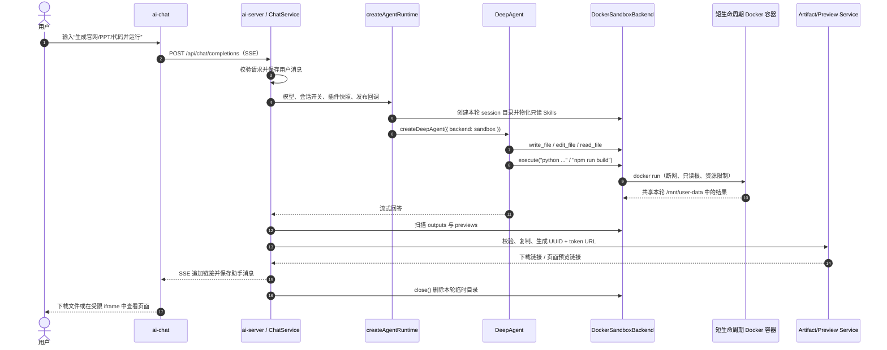
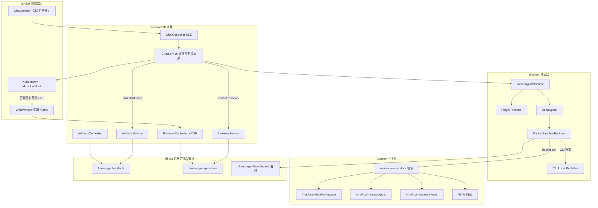

# Keen Agent 沙箱执行、产物下载与页面预览架构

本文集中说明 Keen Agent 新增的 Docker 沙箱能力，包括用户如何使用、代码目录、
DeepAgent 如何接入、文件与命令如何隔离、产物如何发布，以及静态网站如何在聊天页面中预览。

## 1. 设计目标

Web Agent 会接收用户的自然语言，并可能生成文件内容或请求执行 Node、Python、Shell、
Office 文档生成等脚本。模型输出不能直接在 Keen Agent 仓库或 AI Server 进程目录中执行，
因此沙箱实现遵循以下边界：

- 模型不能读取或修改 Keen Agent 仓库、`.env`、宿主用户目录或其他真实项目。
- DeepAgent 的文件操作只作用于本轮会话专属临时目录。
- 所有 Shell、Node、Python 和 Skill 脚本只在 Docker 容器中运行。
- 容器默认断网、根文件系统只读，不挂载 Docker Socket，也不继承宿主环境变量。
- 只有明确写入 `outputs/` 的文件可以发布为下载链接。
- 只有明确写入 `previews/<name>/` 且包含 `index.html` 的目录可以发布为页面预览。
- 发布阶段再次检查普通文件、符号链接、路径、文件数、目录深度和总大小。

沙箱保护的是 DeepAgent 的本地文件和命令能力。模型 Provider、OCR 请求和 HTTP/stdio MCP
连接仍由 AI Server 负责，不会在这个 Docker 容器中执行。MCP 管理属于管理员能力，部署到
公网时必须单独保护插件管理 API。

## 2. 用户能做什么

在插件管理中同时启用以下系统插件和会话“工具调用”开关后，主模型可以使用沙箱：

- `DeepAgent 内置工具`
- `Docker 隔离执行器`
- 任务需要的 Skill 或 MCP

用户仍然只需要发送自然语言，不需要了解 Docker 路径。例如：

```text
根据这份销售数据制作一个带图表的 Excel，并给我下载链接。
```

```text
生成一个科技公司的 React 官网，包含首页、产品卡片和联系按钮，并直接预览。
```

```text
读取我提供的需求，在沙箱中创建 TypeScript 项目，运行测试，然后把源码压缩包给我。
```

如果会话关闭“工具调用”、停用 `deepagent-core`，或者直接选择 `qwen3.5-ocr`，本轮不会
创建 Docker Sandbox Backend。OCR 模型只负责图片文字提取，不运行工具。

## 3. 用户请求的端到端流程



关键顺序是“先发布，后关闭”。如果先调用 `DockerSandboxBackend.close()`，本轮临时目录会
被删除，发布器将找不到源文件。

## 4. 代码整体架构



## 5. 新增文件目录说明

### 5.1 Docker 镜像资源

```text
ai-agent/.sandbox/
├── Dockerfile
├── README.md
├── prepare-web-project
└── web-runtime/
    └── package.json
```

| 文件 | 功能 |
| --- | --- |
| `Dockerfile` | 构建 `keen-agent-sandbox:latest`。安装 Node、Python、文档/表格/图片处理库和离线 React/Vite 依赖，但不放入 Keen Agent 仓库或预制网站源码。 |
| `README.md` | 镜像构建方式、静态网站构建约定和沙箱内目录说明。 |
| `prepare-web-project` | 为模型已经创建的前端项目连接镜像内离线 `node_modules`；缺少 `package.json` 时只补通用构建配置，不生成页面正文。 |
| `web-runtime/package.json` | 固定镜像内 React、React DOM、Vite 和 React Plugin 版本。运行时无需也不允许联网安装依赖。 |

### 5.2 DeepAgent Sandbox Backend

```text
ai-agent/src/sandbox/
├── docker-sandbox.ts
├── index.ts
├── local-artifact-publisher.ts
└── types.ts
```

| 文件 | 功能 |
| --- | --- |
| `docker-sandbox.ts` | 继承 DeepAgent `BaseSandbox`，实现 Docker `execute`、文件上传/下载适配、路径约束、Skill 只读物化、产物/预览扫描和会话清理。 |
| `types.ts` | 定义候选产物、候选预览、发布结果和 `AgentSandboxOptions` 注入协议。 |
| `local-artifact-publisher.ts` | CLI 没有 HTTP API 时，将即将删除的临时产物复制到 `.keen-agent/cli-artifacts` 或 `.keen-agent/cli-previews` 并返回 `file://` URL。 |
| `index.ts` | 沙箱模块的公共导出入口，对应包导出 `@keen-agent/ai-agent/sandbox`。 |

### 5.3 Web 产物与预览 API

```text
ai-server/src/
├── artifacts/
│   ├── artifacts.controller.ts
│   └── artifacts.service.ts
└── previews/
    ├── previews.controller.ts
    └── previews.service.ts
```

| 文件 | 功能 |
| --- | --- |
| `artifacts.service.ts` | 把 `outputs/` 候选文件复制到持久目录，生成 UUID、随机 token、MIME、大小和 SHA-256 元数据；下载时重新校验。 |
| `artifacts.controller.ts` | 提供强制下载 API，设置 `attachment`、禁止缓存和 `nosniff` 响应头。 |
| `previews.service.ts` | 逐项检查并复制静态网站，拒绝符号链接和路径越界，生成签名预览 URL，并解析站内资源或 SPA fallback。 |
| `previews.controller.ts` | 返回 HTML、JS、CSS、图片和字体；用 CSP sandbox、Permissions Policy、opaque origin 与 iframe 共同限制模型生成代码。 |

### 5.4 前端页面预览

```text
ai-chat/app/_components/
├── MarkdownLink.tsx
└── WebPreview.tsx
```

| 文件 | 功能 |
| --- | --- |
| `MarkdownLink.tsx` | 只识别 Nest 签发格式的同源预览链接；普通 URL 仍渲染为普通外链，避免模型随意生成 iframe。 |
| `WebPreview.tsx` | 把签名 URL 放入不带 `allow-same-origin`、表单、下载和新窗口权限的 iframe，并提供独立打开入口。 |

## 6. 重要集成文件

以下文件不是全新模块，但负责把沙箱能力接入既有聊天链路：

| 文件 | 集成职责 |
| --- | --- |
| `ai-agent/src/core/agent.ts` | 根据插件开关创建 `DockerSandboxBackend`，注入 DeepAgent，提供沙箱系统提示、`collectArtifacts`、`collectPreviews` 和统一 `close`。 |
| `ai-agent/src/plugins/runtime.ts` | 把 `docker-sandbox` 系统插件解析成运行时能力；MCP 按插件独立连接，单个失败时降级。 |
| `ai-agent/src/config/plugin-config.ts` | 注册 Docker 系统插件并迁移旧插件注册表，向管理页暴露执行、文件、下载和预览能力。 |
| `ai-agent/src/config/paths.ts` | 定义临时会话、Web/CLI 产物和预览的状态目录。 |
| `ai-agent/src/cli/conversation.ts` | CLI 创建同一 Agent Runtime，收集文件和页面并输出本地链接。 |
| `ai-server/src/chat/chat.service.ts` | 用 `conversationId + userMessageId` 创建本轮沙箱，在模型结束后发布内容，并在 `finally` 中清理。 |
| `ai-server/src/app.module.ts` | 注册 Artifact 和 Preview Controller/Service。 |
| `ai-chat/app/_utils/provider.tsx` | 注册 Markdown 链接渲染器，并把前端流超时延长到可容纳多轮工具执行。 |

## 7. 文件系统与 rootDir

DeepAgent 获得的是自定义 Backend，不是指向仓库的 `FilesystemBackend`。

```text
DeepAgent 虚拟路径                 宿主侧实际路径
/mnt/user-data                    .keen-agent/sandboxes/<session>/user-data
├── workspace/                    模型创建和修改的源码、输入与中间文件
├── outputs/                      可下载文件的唯一出口
├── previews/<site>/              可发布静态网站的唯一出口
└── large-tool-results/           DeepAgent 大型工具结果

/skills/<skill-name>/             .keen-agent/sandboxes/<session>/skills/<skill-name>
/mnt/skills/public/<skill-name>/  同一份 Skill 的兼容只读挂载
```

`DockerSandboxBackend.rootDir` 声明为 `/mnt/user-data`。DeepAgent 传入相对文件路径时，
服务端适配器固定相对于 `/mnt/user-data/workspace` 解析，而不是相对于 `process.cwd()`。
服务端文件传输适配器接受的绝对路径只允许以下虚拟根：

- `/mnt/user-data`
- `/large_tool_results`
- `/skills`（只读）
- `/mnt/skills/public`（只读）

宿主路径解析后还会执行一次 `relative()` 边界检查，并逐级拒绝符号链接。即使模型尝试
`../../../../`、`/etc/...` 或先创建符号链接，也不能让文件适配器逃离会话目录。
通过 `execute` 实现的文本读取和命令可以查看容器镜像自身的 `/etc`、`/opt` 等目录，
但这些目录是只读镜像内容，不是宿主文件；Keen Agent 仓库从未挂载进容器。

### 文件工具与脚本的区别

DeepAgent `BaseSandbox` 的不同工具使用不同通道：

| 操作 | 执行位置 | 说明 |
| --- | --- | --- |
| `ls`、文本 `read_file`、`grep`、`glob`、`delete` | Docker 容器 | BaseSandbox 生成 POSIX 命令，再调用本项目的 `execute`。 |
| `write_file`、`edit_file`、二进制读取 | AI Server 的受限文件适配器 | 只能读写本轮 session 目录；这样可可靠传输二进制内容，但不能访问任意宿主路径。 |
| Shell、Node、Python、npm、Skill 脚本 | Docker 容器 | 不会交给宿主 Shell 执行。 |

这里的“文件适配器在服务端”不等于“模型可以操作本地文件”。模型只能提交虚拟路径，
路径到宿主暂存目录的映射完全由 `resolveHostPath()` 控制。

## 8. Docker 生命周期与安全参数

一次模型请求对应一个沙箱会话目录；一次 `execute` 对应一个短生命周期容器。多次容器
通过同一个只限本轮的 `/mnt/user-data` bind mount 共享文件，命令结束后容器立即删除。

主要 `docker run` 约束：

| 参数 | 目的 |
| --- | --- |
| `--network none` | 禁止容器访问互联网或内网服务。 |
| `--read-only` | 镜像根文件系统只读。 |
| `--cap-drop ALL` | 删除所有 Linux capabilities。 |
| `--security-opt no-new-privileges` | 禁止进程通过 setuid 等方式提权。 |
| `--user 65532:65532` | 使用非 root 用户运行模型脚本。 |
| `--pids-limit 128` | 限制进程/线程数量，降低 fork bomb 风险。 |
| `--memory 768m`、`--cpus 1.5` | 限制内存和 CPU。 |
| `--ulimit fsize=...` | 限制单个容器文件大小为 100 MB。 |
| `--tmpfs /tmp:...size=128m` | 提供有限的临时可写空间。 |

容器只接收 `HOME=/tmp` 和 `PYTHONDONTWRITEBYTECODE=1`。启动 Docker CLI 时使用的
`PATH`、`DOCKER_HOST`、`DOCKER_CONTEXT` 只供宿主 Docker 客户端定位 daemon，不会传入
容器。Docker Socket、仓库目录和模型 API Key 均不挂载。

## 9. 产物下载流程

模型必须把最终文件写到：

```text
/mnt/user-data/outputs/<file>
```

例如模型先用 `write_file` 在工作区创建 `create_slides.py`，再执行：

```bash
python create_slides.py \
  --output /mnt/user-data/outputs/季度总结.pptx
```

模型结束后：

1. `listOutputFiles()` 只遍历 `outputs/`，跳过符号链接并检查数量、深度和总大小。
2. `ArtifactsService.publish()` 将文件复制到 `.keen-agent/artifacts/<uuid>/`。
3. 服务端写入文件名、MIME、大小、SHA-256、会话 ID 和随机 token 元数据。
4. ChatService 把下载 Markdown 链接追加到回答并保存到会话历史。
5. 浏览器访问 `/api/ai-server/artifacts/:id/download?token=...`。
6. Controller 强制使用 `Content-Disposition: attachment` 返回文件。

下载 API 不接受磁盘文件路径，因此用户不能通过 URL 参数访问其他文件。

## 10. React/Vite 页面预览流程

镜像中没有预制官网模板，只有离线依赖。模型必须先创建用户要求的实际源码：

```text
/mnt/user-data/workspace/company-site/
├── index.html
└── src/
    ├── main.jsx
    └── styles.css
```

然后在沙箱中执行：

```bash
prepare-web-project company-site
cd company-site
npm run build
mkdir -p /mnt/user-data/previews/company-site
cp -R dist/. /mnt/user-data/previews/company-site/
```

`prepare-web-project` 只做两件事：

1. 把项目 `node_modules` 链接到镜像中的 `/opt/keen-web-runtime/node_modules`。
2. 项目没有 `package.json` 时写入通用 Vite 构建配置。

它不会创建 `index.html`、React 组件或 CSS。网站内容完全来自本轮用户要求和模型的文件工具。

发布后，回答会出现类似链接：

```text
/api/ai-server/previews/<uuid>/<token>/index.html
```

前端只有在链接严格匹配这个同源签名格式时才渲染 iframe。页面安全由两层共同实现：

- iframe `sandbox="allow-scripts allow-modals"`，不授予 `allow-same-origin`、表单、下载、
  popup 或顶层导航能力。
- Nest 响应设置 CSP sandbox、`connect-src 'none'`、`object-src 'none'`、
  `form-action 'none'`、Permissions Policy、`nosniff` 和 `no-referrer`。

Vite 模块脚本带有 `crossorigin`，而无 `allow-same-origin` 的 iframe 使用 opaque origin，
所以 Preview Controller 对静态资源增加 `Access-Control-Allow-Origin: *`。这只允许读取持有
随机 token 的静态资源，不会恢复 iframe 的同源权限。

当前预览是静态构建结果，不会长期运行 `npm run dev`。容器断网，因此页面不能依赖 CDN、
远程字体或外部 API；需要的前端依赖应预先加入沙箱镜像。

## 11. 配额与持久化边界

| 对象 | 限制 |
| --- | --- |
| 单条命令 | 默认 180 秒，配置范围 1 秒到 10 分钟 |
| 返回给模型的命令输出 | 默认 100 KB，最大可配置 1 MB |
| 命令字符串 | 最多 30,000 字符 |
| 容器资源 | 1.5 CPU、768 MB 内存、128 PID、128 MB `/tmp` |
| 下载产物 | 每轮最多 20 个，总计 250 MB，单文件不超过 100 MB，目录深度 20 |
| 页面预览 | 每轮最多 5 个；每站最多 2,000 文件、100 MB、20 层 |
| Skill | 每 Skill 最多 128 文件、单文件 10 MB、总计 20 MB；符号链接不跟随 |

本轮 `.keen-agent/sandboxes/<session>` 会在流结束、取消或异常后的 `finally` 中删除。
已经发布的 `.keen-agent/artifacts` 和 `.keen-agent/previews` 会持久保留，目前没有自动 TTL
清理策略。它们位于 `.gitignore` 覆盖的 `.keen-agent/` 下，不会进入 Git。

每条用户消息使用独立 session，因此工作源码默认不跨轮保留。如果下一轮需要继续修改
上一轮项目，当前实现需要用户重新提供源码压缩包，或后续增加会话级项目存储；已发布的
下载文件和静态预览本身仍可通过原链接访问。

## 12. 配置和启动

先构建镜像：

```bash
docker build -t keen-agent-sandbox:latest ai-agent/.sandbox
```

再启动 Web：

```bash
pnpm dev
```

相关环境变量：

| 环境变量 | 默认值 | 说明 |
| --- | --- | --- |
| `DOCKER_SANDBOX_IMAGE` | `keen-agent-sandbox:latest` | 沙箱镜像名。 |
| `DOCKER_SANDBOX_COMMAND_TIMEOUT_MS` | `180000` | 单次命令超时。 |
| `AI_AGENT_TIMEOUT_MS` | `300000` | 整轮模型与工具调用超时。 |
| `ARTIFACTS_PATH` | `.keen-agent/artifacts` | Web 下载产物持久目录。 |
| `ARTIFACT_PUBLIC_BASE_URL` | `/api/ai-server/artifacts` | 下载 API 前缀。 |
| `PREVIEWS_PATH` | `.keen-agent/previews` | Web 静态预览持久目录。 |
| `PREVIEW_PUBLIC_BASE_URL` | `/api/ai-server/previews` | 预览 API 前缀。 |

插件管理中的“Docker 隔离执行器”测试会实际启动容器并执行 Python、Node 版本检查，不是
只检查配置文件。修改镜像内容后需要重新执行 `docker build`。

## 13. 常见问题

### 模型说找不到 Skill 脚本

确认 Skill 已启用、目录包含完整 `scripts/`，并且 Docker 隔离执行器和 DeepAgent 内置工具
都已开启。运行时只会把已启用 Skill 复制并只读挂载到 `/skills/<name>/`。

### 页面能打开但只有空白

先检查浏览器控制台和静态 JS/CSS 请求。Vite 必须用相对 base 构建；默认
`prepare-web-project` 的 `npm run build` 已包含 `vite build --base ./`。Preview Controller
还必须保留匿名 CORS 响应头，否则 opaque-origin iframe 会阻止模块脚本。

### 模型执行了命令却没有下载链接

确认最终文件位于 `/mnt/user-data/outputs`，而不是仅放在 `workspace`。空文件、符号链接、
超限文件不会发布。

### 页面没有出现在回答中

确认目录结构是 `/mnt/user-data/previews/<name>/index.html`。直接把 `index.html` 放在
`previews/` 根目录不会被识别，因为一级子目录代表一个独立站点。

### MCP 能否绕过 Docker 沙箱访问宿主

Docker 沙箱不会自动约束管理员配置的 MCP。stdio MCP 在 AI Server 上启动，HTTP MCP 由
AI Server 联网连接，因此插件管理 API 必须受保护，MCP 命令、工作目录和授权范围必须由
管理员审核。单个 MCP 连接失败会降级并显示警告，不会让整个聊天初始化失败。

## 14. 验证命令

```bash
pnpm typecheck
pnpm --filter @keen-agent/ai-server build
pnpm --filter @keen-agent/ai-chat lint
pnpm --filter @keen-agent/ai-chat build
docker image inspect keen-agent-sandbox:latest
```

也可以在插件管理中测试“Docker 隔离执行器”，再用以下两类实际任务验收：

1. “用 Python 生成一个 PDF 并提供下载链接。”
2. “从零创建一个 React 官网、完成 Vite 构建并直接预览。”
